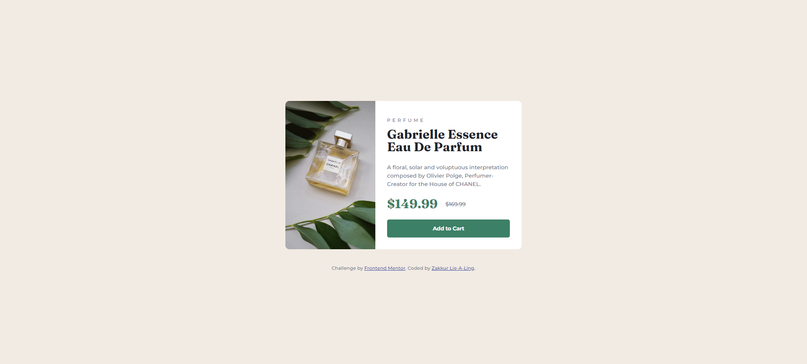

# Frontend Mentor - Product Preview Card Component Solution

This is my solution to the [Product Preview Card Component challenge on Frontend Mentor](https://www.frontendmentor.io/challenges/product-preview-card-component-GO5Xw4tZ2). Frontend Mentor challenges help you improve your coding skills by building realistic projects.

## Table of Contents

- [Overview](#overview)
  - [The Challenge](#the-challenge)
  - [Screenshot](#screenshot)
  - [Links](#links)
- [My Process](#my-process)
  - [Built With](#built-with)
  - [What I Learned](#what-i-learned)
  - [Useful Resources](#useful-resources)
- [Author](#author)

## Overview

### The Challenge

The challenge was to build a responsive product preview card component that matches the provided designs for mobile (375px) and desktop (1440px) layouts. The card includes an image, product details, pricing, and a call-to-action button, styled to closely resemble the design files. The page should be accessible, use semantic HTML, and include hover and focus states for interactive elements.

### Screenshot



### Links

- **Live Site URL**: [https://zakkur17.github.io/Product-preview-card-component/]
- **Solution URL**: [https://github.com/Zakkur17/Product-preview-card-component.git]

## My Process

### Built With

- Semantic HTML5 markup (e.g., `<main>`, `<section>`, `<button>`)
- CSS custom properties for colors and spacing
- Flexbox for layout and alignment
- Mobile-first workflow
- Google Fonts: Montserrat (weights 500 and 700) and Fraunces (weight 700)

### What I Learned

This project helped me solidify several key skills:

- **Responsive Design**: Using a mobile-first approach and media queries to adjust the layout for mobile (375px) and desktop (1440px) viewports.
- **Flexbox**: Utilizing Flexbox to create a flexible layout that transitions from a single column on mobile to a two-column layout on desktop. For example:
  ```html
  <main class="card">
    <picture>
      <source media="(min-width: 768px)" srcset="./images/image-product-desktop.jpg">
      
    </picture>
    <section class="card-content">
      <p class="product-category">Perfume</p>
      <h1 class="product-title">Gabrielle Essence Eau De Parfum</h1>
      <p class="product-description">
        A floral, solar and voluptuous interpretation composed by Olivier Polge, 
        Perfumer-Creator for the House of CHANEL.
      </p>
      <div class="price">
        <span class="current-price">$149.99</span>
        <span class="original-price">$169.99</span>
      </div>
      <button class="add-to-cart">Add to Cart</button>
    </section>
  </main>
  ```
- **Interactivity**: Adding hover and focus states to the "Add to Cart" button to enhance user experience.
- **Image Handling**: Using the `<picture>` element to switch between mobile and desktop images for optimal display.

### Useful Resources

- [MDN Web Docs](https://developer.mozilla.org/en-US/) - Great reference for HTML semantics and CSS properties.
- [CSS Tricks - Flexbox Guide](https://css-tricks.com/snippets/css/a-guide-to-flexbox/) - Helped me master Flexbox for this layout.
- [Google Fonts](https://fonts.google.com/) - Used to import the Montserrat and Fraunces fonts.

## Author

- Name: Zakkur Lie-A-Ling
- Frontend Mentor: [@Zakkur17](https://www.frontendmentor.io/profile/Zakkur17)
- GitHub: [@Zakkur17](https://github.com/Zakkur17)


